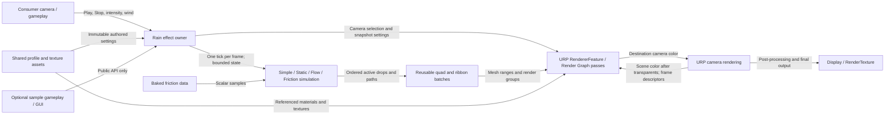

# C4 Component View: Rain effect inside a Unity player

Research: [INDEX.md](INDEX.md)
Parent: none
Status: proposed

## Scope

One Unity player/runtime contains the consumer scene and the proposed URP rain package. This view separates responsibilities currently mixed across camera control, four behaviour/controller pairs, drawers, trail meshes and shader helpers. It is a component view, not a class/file prescription. No separate C4 context/container file is justified for this one-runtime library.

## Diagram

## Components

| Component | Responsibility | Interface / data | Evidence or design basis |
|---|---|---|---|
| Consumer camera/gameplay | Own scene cameras and gameplay | Public playback/parameter API | Existing RainCameraController callers and demo scripts, E02/E10/E11 |
| Rain effect owner | Validate settings, select camera, own lifetime and simulation state | Profile reference, per-camera overrides, Play/Stop/Clear | Proposed replacement for E02/E03 orchestration; ADR-0002 |
| Shared profile/assets | Store reusable curves, masks, texture/material references and defaults | Immutable shared authored data | Existing Variables and prefab texture references, E03/E09/E12 |
| Family simulation | Update emissions, fades, paths and friction decisions | Bounded state; explicit delta time and seed | Existing four families, E03/E06/E07; reuse behavior, replace allocations |
| Baked friction data | Provide compact CPU-sampleable scalar values with explicit coordinates | Grid dimensions/values and sampling convention | E07/E15; migration establishes old-to-new interpretation |
| Quad/ribbon batches | Build valid ordered geometry into reused storage | Mesh ranges, bounds, material/texture group key | Replaces RainDrawer/DropTrail object graph, E04/E05 |
| RendererFeature/passes | Bind camera inputs and draw batches into separate output | C0 source, C1 destination, transient graph textures | ADR-0002; official references U01–U05/U14 |
| URP camera renderer | Render the host scene and consume resulting camera color | Frame descriptors, target/stack state, post-processing | External package dependency inside the same Unity process |
| Optional samples | Demonstrate rain, HP/blood, splash, audio and GUI | Public API only | E10/E11; excluded from Runtime dependency graph |

## Relationships and constraints

Settings flow from immutable profiles to per-camera state. A shared profile must not become a singleton mutable simulation. Rendering reads a stable snapshot; camera B cannot overwrite data deferred for camera A. Simulation updates once per frame even if the renderer processes multiple cameras.

Texture flow is deliberately C0 → C1. The cycle drawn between URP and the feature denotes a render-pipeline extension returning output within a frame, not recursion or a dependency cycle. C1 is initialized from C0, then receives ordered rain draws; all refraction samples C0. A visible blur path can derive a lower-resolution source from C0. Graph handles do not outlive their camera/frame. Owned meshes/materials and external resources have explicit cleanup.

Base/Overlay handling is an unresolved implementation detail bounded by a required result: one intended application with transparent scene content and no double simulation. The P1 stack experiment must choose the exact routing from the installed URP version. Reflection/Preview/unrelated cameras are excluded; Scene View preview is explicit.

Editor inspectors/conversion live in an Editor-only assembly outside this runtime view. They write profile/prefab assets through explicit operations. Runtime never depends on samples, Editor or host MCP/tool DLLs. World-space glass and XR are outside this diagram under the current unconfirmed scope assumption.
