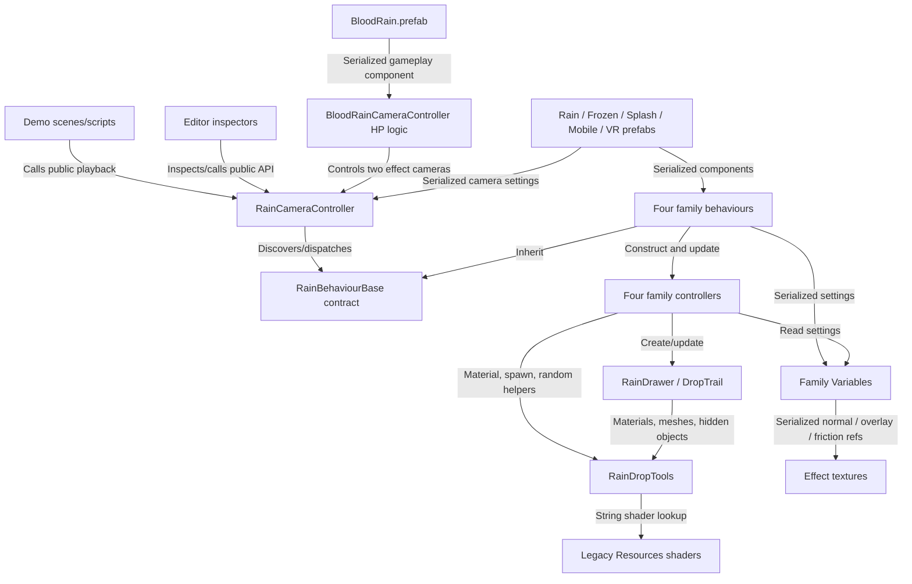
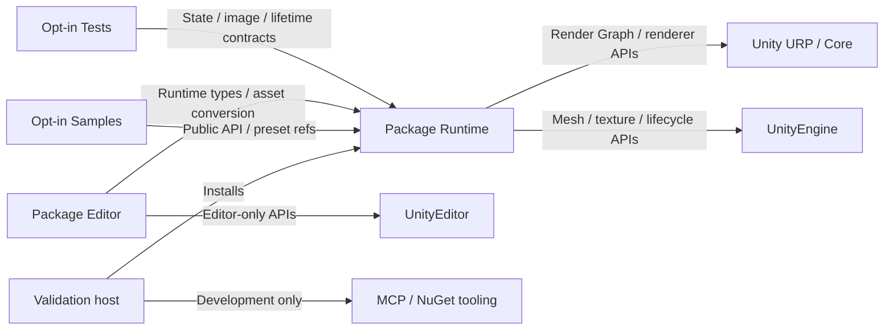

# Dependency Graph: Safe separation and migration order

Research: [INDEX.md](INDEX.md)
Status: active

## Current dependencies

Arrows mean the source depends on the destination. Paths/evidence refer to the original inspected revision in RESEARCH §1. This combines source call/type edges and serialized asset references; it is not inferred solely from incomplete Unity call-graph dispatch.

## Edges and migration consequences

| From | To | Type | Why required / risk | Evidence |
|---|---|---|---|---|
| Demo/inspectors/HP | Camera API | Source call/type | API renames affect examples and inspectors; HP does not belong in the general effect runtime | E02/E10/E11; RainCameraControllerInspector |
| Camera | Behaviour contract | Discovery/dispatch | Preserve all four runtime families; graph resolves only some virtual calls | E02/E03 |
| Behaviours | Controllers + Variables | Lifetime + settings | A folder move alone leaves duplicate controller objects and Update forwarding | E03 |
| Controllers | Drawer/trail + tools | Rendering/material | Material creation is shared across Flow/Friction initializers/shader changes and RainDrawer.Show | E04/E06; traced CreateRainMaterial callers |
| Trail | Mesh buffers | Runtime allocation | Each active trail rebuilds arrays; central resource/geometry change affects multiple families | E05 |
| Friction controller | Texture/Transform math | CPU sampling | New data interpretation and coordinate math affect visual path parity | E07/E15 |
| Prefabs | Script GUIDs + textures | Serialized references | Asmdef/type/field/asset moves require migration evidence; do not regenerate retained GUIDs | E09/E12 |
| Shader helper | Legacy shaders | String lookup/build inclusion | URP replacement must remap references and verify stripped player builds | E04/E08 |

No library-to-Demo GUID references were found in the scanned prefab/material/asset set. This does not negate the packaging problem or the HP coupling inside BloodRain.prefab, and does not assert an exhaustive dynamic-reference proof. Host NuGet/MCP dependencies are separate: runtime using directives do not reference them, so they should not enter package metadata; host tooling can remain.

## Proposed dependency boundary

## Findings and critical ordering

The safe extraction point is between consumer/demo/gameplay code and the effect API, with Editor separated by assembly. The safe rendering replacement point is where controllers feed RainDrawer/DropTrail/material helpers: replacing only the named mobile shader would leave the shared object/material/mesh costs across all families.

P0 establishes the old API/assets and visual contract. P1 must establish sampleable scene color, compatible renderer APIs and the direct-versus-field choice before mass simulation/prefab conversion. P2's assembly identities and P3/P4's setting units converge with P5's shader/quality semantics in P6 migration. P6 cannot be finalized from folder names alone. P7 depends on clean-package installation and actual target-device evidence; Editor compilation is not a substitute.

There is no demonstrated source dependency cycle requiring a framework rewrite. The non-linear coupling is between shared rendering utilities, four simulation families, authored profiles, editor/demo consumers and serialized prefab identities. Keep a single runtime renderer and explicit conversion boundaries; avoid parallel permanent old/new rendering stacks.

Material conclusions carried into Active Summary: REQ-01/06 package/migration boundaries; REQ-03 four-family preservation; REQ-04 shared-root allocation removal; RISK-03 serialized migration; RISK-04 friction interpretation; P1 before large-scale conversion.
